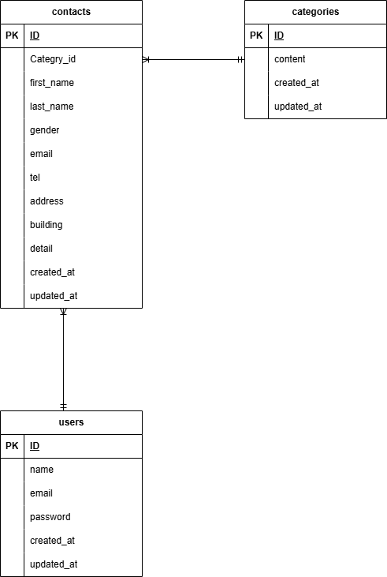

Dockerビルド
・git clone https://github.com/hyouga07/Check-test.git
・cd Check-test

Laravel環境構築
・docker-compose up -d --build
・composer install
・cp .env.example .env、開発変数を適宜変更
・php artisan key:generate
・php artisan migrate
・php artisan db:seed

URL
・お問い合わせ画面: http://localhost/
・ユーザー登録: http://localhost/register
・phpMyAdmin: http://localhost:8080/

使用技術(実行環境)
・PHP 8.x
・Laravel 9.x
・Composer 2.x
・MySQL8.0.26
・Nginx1.21.1

ER図

※透過で見えないかもしれないので元のER作成元の.drawio.pugもファイルに入れています
  Draw.io Extension for VSCodeをVSCode内にインストールして確認してください